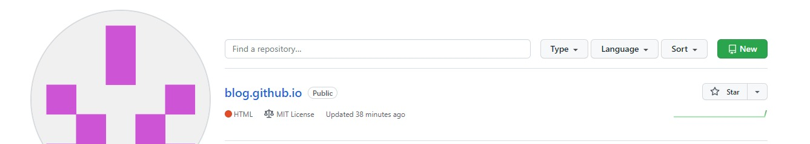
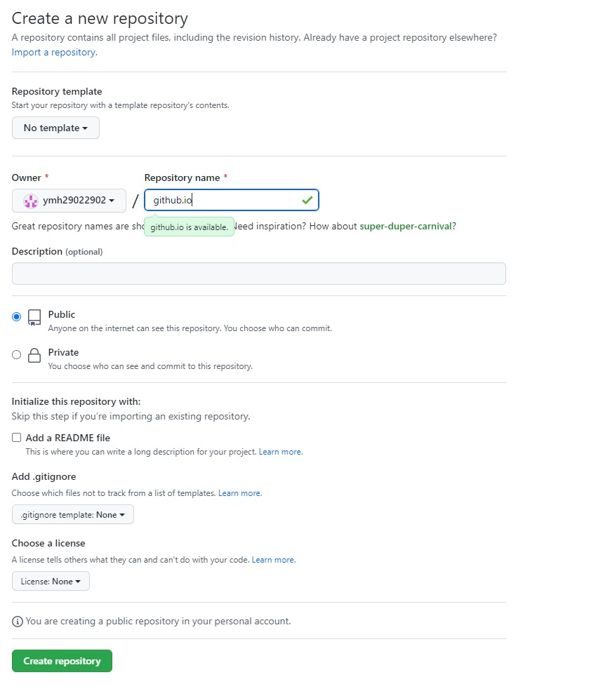
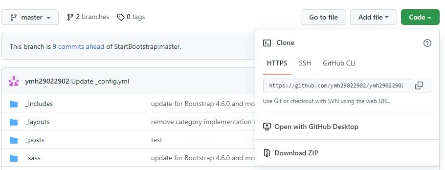
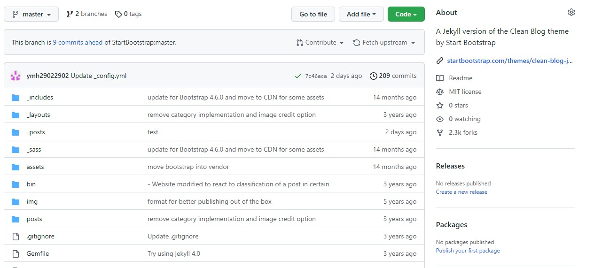
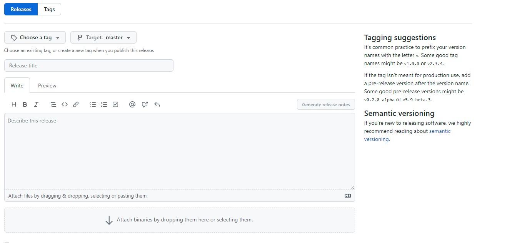

# Chapter 1

## github
 

### github란?
* 분산 버전 컨트롤 소프트웨어 깃(Git)을 기반으로 소스 코드를 호스팅하고, 협업 지원 기능들을 지원하는 마이크로소프트의 웹 서비스
* 2007년 샌프란시스코에 위치한 본사에서 톰 프레스틴 워너(Tom Preston-Werner), 크리스 완스트래스(Chris Wanstrath), 피 제이 하이엣(P.J.Hyett)을 중심으로 루비 온 레일스(Ruby on Rails)로 개발, 2008년 2월 웹 서비스로 개발됨. 이후 2018년 6월 4일 마이크로소프트에서 인수, 현재 자회사로 운영중
* 매년 깃허브 생태계에 대해 옥토버스(Octoverse)라는 레포트를 공개
  

### 형상관리란?
* 소프트웨어 구성 관리(Software COnfiguration ManageMent) : 소프트웨어의 변경사항을 체계적으로 추적하고 통제하는 것
* 일반적인 단순 버전관리 기반의 소프트웨어 운용을 좀 더 포괄적인 학술 분야의 형태로 넓히는 근간
>> 변경관리 : 소스코드 변경 사항에 대한 관리  
>> 버전 관리 : 변경사항을 버전이란 개념을 통해 관리
 

  #### 형상 관리의 구조
  
  * 형상 식별(Configuration Identification) : 형상 관리의 대상이 무엇인지 식별하는 것. 
  * 형상 제어(Configuration COntrol) : 형상 항목의 버전(version control)과 변경에 대한 판단을 내리는 것
  * 형상 감사(Configuration Audit) : 요구대로 형상 항목의 변경이 제대로 이뤄졌는지 살펴보는 것
  * 형상 상태 보고(Configuration Statue Accounting) : 변경된 형상 항목을 관계된 사람들에게 알리는 것  
  

### git과 github의 차이점
 

#### git
 

* 로컬에서 관리되는 오픈 소스 버전 관리 시스템(VCS : Version Control System)
* 소스코드 수정에 따른 버전을 관리해주는 시스템
* 브랜치의 생성, 이전 브랜치 복구, 삭제, 병합이 가능
* 로컬 저장소를 사용하므로 다른 개발자와 실시간으로 작업을 공유할 수 없음
 

#### github
 

* Git 저장소를 관리하는 클라우드 기반 호스팅 시스템(VCS)
>> 코드가 변경된 기록을 모두 로그화
자체 구축이 아닌 빌려쓰는 클라우드 개념
* 오픈소스는 일정 부분 무료로 저장 가능, 아닐 경우 유료로 사용
* Git으로 로컬 저장소에 작업한 내용을 저장한 뒤 해당 내용을 Github에 업로드하는 형식으로 사용
  

### github의 사용법

</img>

1. 로그인 후 new를 클릭해 프로젝트를 생성한다.

</img>

2. Repository 입력 후 Create repository를 누른다.

</img>

3. git clone을 통해 코드를 복사 후 소스트리 같은 GUI툴에 접속한다.

>  Git GUI(Graphic User Interface) : 초보자가 명령이나 작업을 이해하기 쉽도록 프로젝트 히스토리를 시각화하여 도와주는 도구

</img>

3. git clone을 통해 코드를 복사 후 소스트리 같은 GUI툴에 접속한다.

</img>

4. clone해온 코드를 소스 경로에 복사, 파일을 저장할 경로를 지정한 후 클론한다.

</img>

5. 이후 저장된 폴더에서 변경사항이 있을 경우 하단에 자동으로 변경 목록이 나타난다.

</img>

6. 스테이지에 올릴 파일을 선택한 후, 변경사항 등의 내용을 기입, 커밋한다.

</img>

7. 커밋된 파일은 Push를 통해 원본인 github 서버로 전송이 된다.

</img>

8. github 사이트로 접속해 정상적으로 적용되었는지 확인한다.
  

### Fork, Pull Request

#### Fork 
* 상대방의 저장소를 나의 저장소로 그대로 복사, 찍어내는 것
* 수정된 파일은 원작자의 저장소가 아닌, 본인의 저장소에 저장됨
* 저장소에 업로드 되는 과정을 커밋(commit)이라고 하며, 커밋 과정시엔 커밋 메세지를 통해 변경사항을 기록하여야 한다.
 

#### Pull Request  
* 본인의 저장소에 복사된 저장소로 입장, pull request 탭으로 들어가 new pull request를 선택한 후 본인의 파일을 pull  request 할 수 있다.
* 저장소의 원작자에게 자신이 제작한 파일을 '가져가서 적용'해줄 것을 요청
* commit과 마찬가지로 커밋 메세지를 통해 상세 내역 기록
 

### Pull, Push, COmmit, Merge, Branch

* 풀(Pull) : Github(또는 원격 저장소)에서 파일을 다운로드하는 작업
* 커밋(Comit) : Git(로컬 저장소)에 파일을 추가하거나 변경 내용을 저장하는 방법
* 푸쉬(Push) : Github(또는 원격 저장소)에 파일을 추가하거나 변경 내용을 저장하는 작업
* Merge : 여러 개의 브랜치를 하나로 모으는 브랜치 통합 방식
 

### Issue, Project, Tag, Release

#### Issue 
* 프로젝트 기획, 새롭게 추가될 기능, 버그와 수정사항 등 모든 것
* 모든 활동 내역에 대해서 이슈를 등록하고 등록한 이슈를 기반으로 작업을 진행할 수 있기에 프로젝트의 작업, 개선 사항 및 버그를 추적하는 좋은 방법으로 사용됨.
 

* 개발자간 idead, work, bug(problem)을 다루기 위해 깃허브는 이슈를 사용함.
  * 아이더 구현에 관한 논의
  * 작업 진행사항 추적
  * 기능 제안 수락, 질문, 요청 지원 또는 버그 보고
  * 정교한 코드 구현
 

* 이슈를 등록하기 위한 단계
  * 이슈 탭 오픈
  * 해당 문제, 상황을 재현할 수 있는 최대한 많은 정보(context)를 제공
  * 해당 환경 정보(버전, os 등) 관련이 있다고 생각하는 모든 정보를 제공
 

* 이슈 등록 후의 단계
  * 프로젝트 팀(혹은 매니저)이 라벨(label)과 담당자(assingn)을 지정
  * 담당자의 신속한 응답 환경 구축을 위한 노력
  * 해결이 되거나 오랜 기간 답변이 없을 경우, 이슈는 닫힘(closed).

#### project

* 작업이 발생했을 떄 아주 간단하거나 작은 것이 아닐 경우 프로젝트라고 정의

#### Tag

* 커밋을 참고하기 쉽도록 알아보기 쉬운 이름을 붙이는 것
* 한번 붙인 태그는 브랜치처럼 위치가 이동하지 않고 고정됨
* Git 에서는 일반 태그와 주석 태그를 사용할 수 있음
  * 일반 태그(Lightweight tag)
    * 이름 정보만을 가짐
  * 주석 태그(Annotated tag)
    * 이름뿐 아니라 태그에 대한 설명, 서명, 제작자명, 날짜 정보등을 포함 가능
#### Release

* 소프트웨어의 소스코드 뿐만 아니라 소프트 웨어를 빌드한 결과물을 배포할 수 있는 기능

</img>
> 깃허브의 우측에 위치해있다.

</img>
> Create a new release를 통해 새로운 릴리즈를 작성할 수 있으며, master 브랜치에 달려있는 태그와 함께 릴리즈 제목, 릴리즈 노트 그리고 소스코드를 빌드한 바이너리를 첨부할 수 있다. 