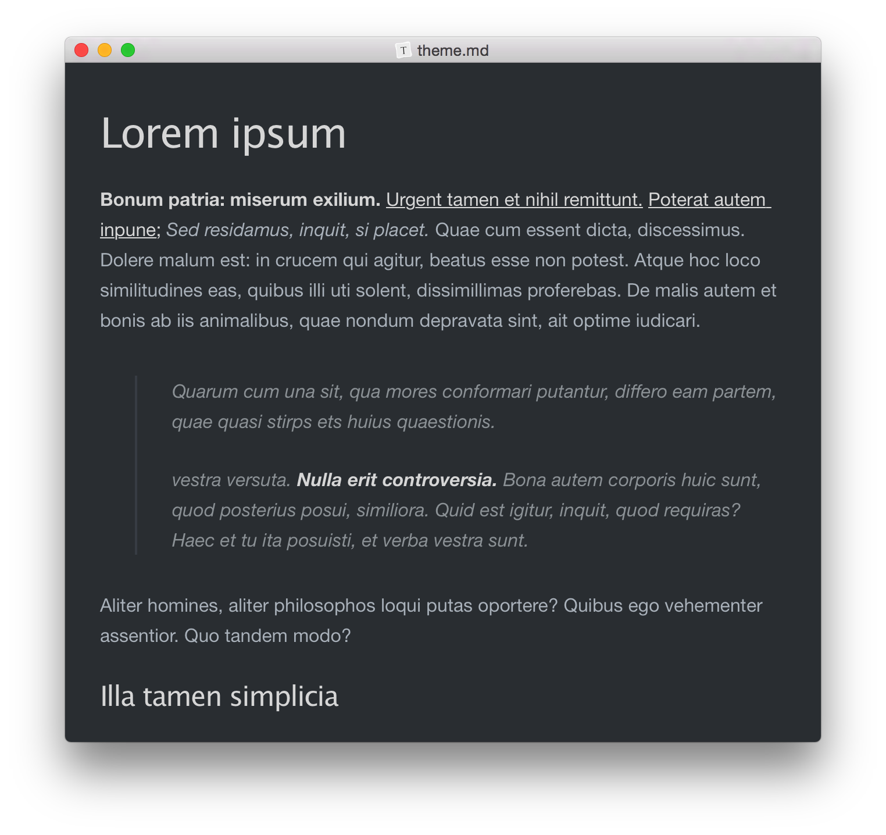
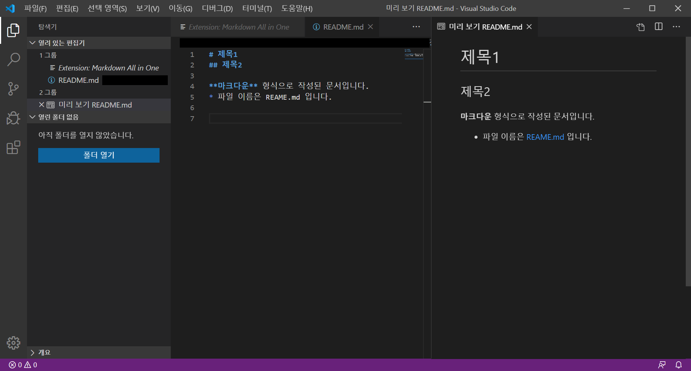
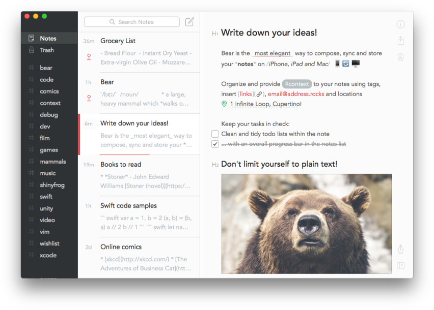
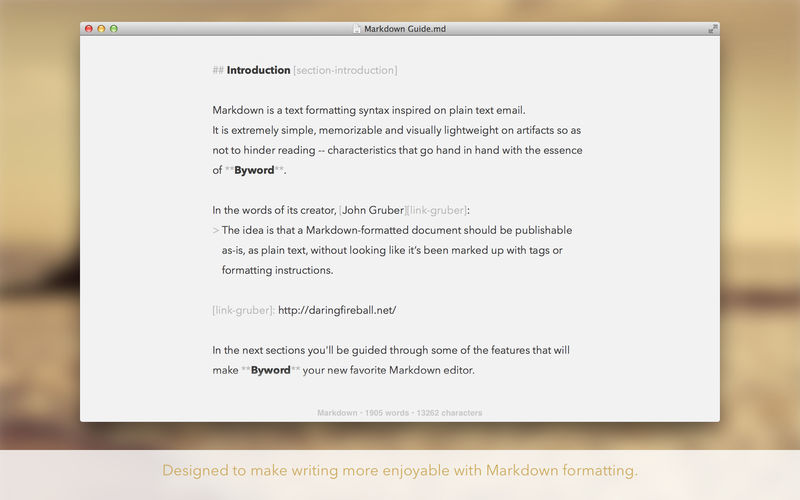

# 마크다운
<br/>

## 마크다운이란?
* 텍스트 기반의 마크업 언어
* 존 그루버(John Gruber)와 아론 스워츠(Aaron Swartz)에 의해 2004년 탄생하였다.
* 특수기호와 문자를 잉용한 매우 간단한 구조의 문법을 사용하여 웹에서도 보다 빠르게 컨텐츠를 작성하고 직관적으로 인식이 가능하다.
* 깃허브를 접해본 이들에겐 README.md가 익숙할 것이다.
<br/><br/>

<hr/>

## 마크다운의 장점·단점
<hr/>

### 장점
<pre>
1. 간결하고 별도의 도구 없이 작성이 가능하다.
2. HTML을 비롯하여 다양한 형태로 변환이 가능하다.
3. 텍스트(Text)로 저장되기 때문에 용량이 적다는 이점을 지니며, 이로 인해 보관이 용이하다.
4. 텍스트파일이기 때문에 버전관리시스템을 통해 변경이력의 관리가 가능하다.
5. 지원하는 프로그램과 플랫폼이 다양하다.
</pre>
### 단점
<pre>
1. 표준이 없으며, 이로 인해 도구에 따라 변환방식이나 생성물이 다르다.
2. 모든 HTML 마크업을 대신하지 못한다.
</pre>
<br/>

<hr/>

## 마크다운 사용법
<hr/>

### 마크다운 에디터
<hr/>

### Typora


    
* 주소 : https://typora.io/
* 장점
    * 프리뷰 화면에서 수정이 가능하다(편집물과 출력물이 동일하게 나오는위즈윅(WYSIWYG) 방식).
    * 다양하고 깔끔한 테마와 레이아웃 / 테마 CSS 직접 수정이 가능하다.
    * 멀티 플랫폼을 지원한다.
    * LaTex/ 테이블 / UML Diagram 지원
    * 포커스 모드/ 타자기 모드
* 단점 
    * 15일간의 체험 기간이 지나면 유료 구매가 필요하다.
    * 스마트폰 미지원.
    * 다른 플랫폼과 연동시 외부 저장소가 필요하다.
<br/>    

### Inkdrop


* 주소 : https://www.inkdrop.app/
* 장점
    * 다양한 플랫폼을 지원한다.
    * 노트북 형식으로 폴더를 지원한다.
    * 태그 + 4가지 상태 (Active, On Hold, Completed, Dropped)로 분류가 가능하다.
    * 자체 패키지 매니저(ipm)이 있어서 오픈소스 플러그인으로 확장 기능 설치 가능
* 단점
    * 비교적 속도가 느린 편이다.
    * 디자인이나 UI가 타 편집기에 비해 떨어지는 편이다.
<br/>

### Visual Studio Code



* 주소 : https://code.visualstudio.com/
* 장점
    * 다양한 개발 언어와 code completion 기능을 지원한다
    * 기본적으로 제공하는 GIT 연동 기능을 통해 바로 GitHub에 글을 동기화할 수 있다.
    * VS code 상에서 terminal이 실행 가능하다.(단축키: ctrl+`)
* 단점
    * 비교적 최신 에디터이기에 마크다운 관련 기능이 부족하다.
    * 업데이트 후 간혹 한글 입력이 누락되는 버그 현상이 발생한다.
<br/>


### Bear



* 주소 : https://bear.app/
* 장점
    * 다양한 테마와 깔끔한 레이아웃을 지원함
    * 문서 간 링크 기능을 지원함
    * 태그 및 아카이브 기능을 지원함
    * 다양한 배포 옵션이 있으며 앱과 자유로운 연동(동기화)이 가능하다.
* 단점
    * 애플 계열 플랫폼만 지원한다.
    * 폴더 미지원으로 많은 문서를 분류하기가 어렵다.
<br/>

### Byword 2



* 주소 : https://bywordapp.com/
* 장점
    * 간결한 디자인 덕분에 방해받지 않고 집중할 수 있다.
    * Light, Dark로 구성된 깔끔한 테마 2종.
    * Meduim, WordPress, tumblr, Blogger, Evernote 등 다앙한 배포가 가능하다.
    * iCloud Drive를 지원한다,
* 단점
    * 프리뷰 화면으로 전환이 불편하다
    * macOS와 iOS에 대해 따로 구입이 필요하다.
    
<br/>

      
<hr/>

## 문법(Syntex)

<hr/>

### 헤더(Headers) 
* 큰 제목 : 문서 제목<pre>
This is an H1
=============
</pre> 

# This is an H1
* 작은 제목 : 문서 부제목<pre>
This is an H2
-------------
</pre>

## This is an H2

* 글머리 : 1~6까지 지원한다.
*  HR(Horizontal Rule, 수평선 구분자)과 결합해 사용이 가능하다.
<pre>
# This is a H1
## This is a H2
### This is a H3
#### This is a H4
###### This is a H5
####### This is a H6

### This be added to hr
</pre>

# This is a H1

## This is a H2

### This is a H3

#### This is a H4

##### This is a H5

###### This is a H6

### This be added to hr
___
<br/>

### 본문(paragraph)
* HTML의 <p>와 같은 본문은 텍스트를 그대로 작성하면 된다.
<pre>This is a paragraph</pre>
This is a paragraph

<br>

### BlockQuote
* 이메일에서 사용하는 > 블럭인용문자를 이용한다.
<pre>
> This is a first blockquote.
>> This is a second blockquote.
>>> This is a third blockquote.
>>>   > This is a last blckquote.
</pre>

> This is a first blockquote.
>> This is a second blockquote.
>>> This is a third blockquote.
>>>   > This is a last blockquote

BlockQuote 안에서는 다른 마크다운 요소를 포함할 수 있다
> ### This is a H3
>> * Ul
>>> + ol
>>>    > ~~content~~


### 목록
* 순서있는 목록(번호)
    * 순서있는 목록은 숫자와 점을 사용한다.
    <pre>
    1. 첫번째
    2. 두번째
    3. 세번째</pre>

    1. 첫번째
    2. 두번째
    3. 세번째

    * 순서를 바꿔서 적어도 출력물은 항상 내림차순으로 정의된다.
    <pre>
    1. 첫번째
    3. 세번째
    2. 두번째</pre>

    1. 첫번째
    3. 세번째
    2. 두번째

* 순서없는 목록 (글머리 기호: *, +, - 지원)
<pre>
* 빨강
    * 주황
        * 노랑

+ 빨강
    + 주황
        + 노랑      

- 빨강
    - 주황
        - 노랑</pre>

* 빨강
    * 주황
        * 노랑

+ 빨강
    + 주황
        + 노랑      

- 빨강
    - 주황
        - 노랑

기호를 혼합해서 사용해도 출력은 정상적으로 작동한다.
<pre>
* one
    - two
        * three
            + four</pre>

* one
    - two
        * three
            + four            

### 코드
4개의 공백, 또는 하나의 탭으로 들여쓰기를 만나면 변환되기 시작하여 들여쓰지 않은 행을 만날때까지 변환이 계속된다.

* 들여쓰기
<pre>
This is a normal paragraph:

    This is a code block.
    
end code block
</pre>    

This is a normal paragraph:

    This is a code block.

end code block    

한 줄을 띄어쓰지 않으면 들여쓰기가 제대로 작동하지 않는다.

<pre>
This is a normal paragraph:
    This is a code block.    
end code block
</pre>

This is a normal paragraph:
    This is a code block.   
end code block 

<br>

* 코드블럭

    * 코드블럭 이용엔 다음과 같은 2가지 방식이 존재한다.

    `<pre><code>{code}</code></pre>` 이용방식

        * 마크다운은 코드블럭을 `<pre>`와 `code`로 감싼다.
        
    ```
    <pre>
    <code>
    public class StartStudyByMarkdown{
        public static void main(String[] args){
            System.out.PrintIn("MarkDown");
        }
    }
    </code>
    </pre>
    ```
    
    <pre>
    <code>
    public class StartStudyByMarkdown{
        public static void main(String[] args){
            System.out.PrintIn("MarkDown");
        }
    }
    </code>
    </pre>

    * 코드블럭코드("```")를 이용하는 방법

    <pre>
    ```
    public class StartStudyByMarkdown{
        public static void main(String[] args){
            System.out.PrintIn("MarkDown");
        }
    }
    ```
    </pre>

    ```
    public class StartStudyByMarkdown{
        public static void main(String[] args){
            System.out.PrintIn("MarkDown");
        }
    }
    ```
<br/>
   
* 깃헙에서는 코드블럭코드("```") 사적점에 사용하는 언어를 선언하여 문법강조(Syntax highlighting)가 가능하다.

    <pre>
    ```java
    public class StartStudyByMarkdown{
        public static void main(String[] args){
            System.out.PrintIn("MarkDown");
        }
    }
    ```
    </pre>

    ```java
    public class StartStudyByMarkdown{
        public static void main(String[] args){
            System.out.PrintIn("MarkDown");
        }
    }
    ```

### 수평선`<hr/>`<hr/> 
* 마크다운 문서를 미리보기로 출력할 때 페이지 나누기 용도가 주된 용도이다.
* 아래 줄은 모두 수평선을 생성한다.   
<pre>
* * *
***
*****
- - -
-------------------------
</pre>
=>
* * *
***
*****
- - -
-------------------------

### 링크
* 참조링크
<pre>
[link keyword][id]

[id]: URL "Optonal Title here"

// code
Link: [Google][googlelink]

[googlelink]: https://www.google.co.kr "Go google"
</pre>

Link: [Google][googlelink]

[googlelink]: https://www.google.co.kr "Go google"

* 외부링크
<pre>
사용문법 : [Title](link)
적용예 : [Google](https://google.co.kr, "google link")
</pre>

[Google](https://google.co.kr, "google link")

* 자동연결
<pre>
일반적인 URL 혹은 이메일주소인 경우 적절한 형식으로 링크를 형성한다.

* 외부링크 : http://example.com/
* 이메일링크 : address@example.com
</pre>

* 자동연결
<pre>
일반적인 URL 혹은 이메일주소인 경우 적절한 형식으로 링크를 형성한다

* 외부링크 : http://example.com/
* 이메일링크 : address@example.com
</pre>
* 외부링크 : http://example.com/
* 이메일링크 : address@example.com

<br>

### 강조

<pre>
*emhpasize*
_emphasize_
**emphasize**
__emphasize__
~~emphasize~~
</pre>
*emhpasize*   
_emphasize_   
**emphasize**   
__emphasize__   
~~emphasize~~

<br/>

* 문장 중간에 사용할 경우에는 ~~띄어쓰기~~ 를 사용하는 것이 좋다. 

<br/>

### 이미지

<br/>

### 줄바꿈
* 3칸 이상 띄어쓰기(   )를 하면 줄이 바뀐다.

<pre>
    * 줄 바꿈의 조건은 문장 마지막에서 3칸 이상을 띄어써야 한다.   그래야만 줄바꿈이 된다.
     * 줄 바꿈의 조건은 문장 마지막에서 3칸 이상을 띄어써야 한다.___\\ 그래야만 줄바꿈이 된다.
</pre>

* 줄 바꿈의 조건은 문장 마지막에서 3칸 이상을 띄어써야 한다.   
그래야만 줄바꿈이 된다.
